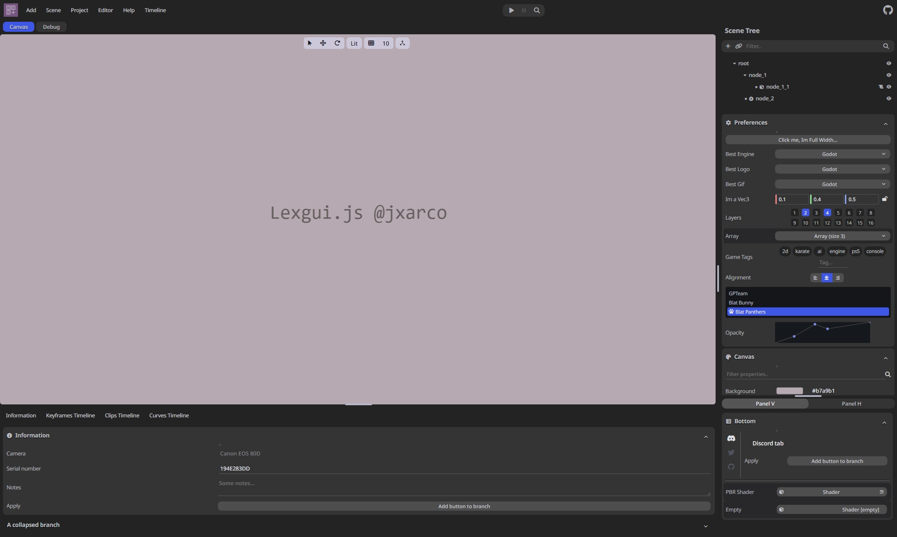

# lexgui.js

**lexgui.js** is a lightweight JavaScript library that allows you to create web interfaces using only JavaScript, HTML, and CSS. This library provides an easy-to-use API for building dynamic and interactive user interfaces without the need for complex frameworks or libraries. With lexgui.js, you can create custom UI components, handle user interactions, and update the interface dynamically.



- [lexgui.js](#lexguijs)
  - [Getting Started](#getting-started)
    - [Download](#download)
    - [Usage](#usage)
  - [Area](#area)
    - [Menubar](#menubar)
    - [Panel](#panel)
  - [Widgets](#widgets)
    - [Title](#title)
    - [Text](#text)
    - [Button](#button)
    - [Number](#number)
    - [Vector](#vector)
    - [Checkbox](#checkbox)
    - [Dropdown](#dropdown)
    - [Tree](#tree)
    - [Progress](#progress)
  - [Event Handling](#event-handling)
  - [Styling](#styling)
  - [Examples](#examples)
  - [Contributing](#contributing)
  - [License](#license)

## Getting Started

### Download

To use LexGUI.js, download the library `build` folder and include it directly in your HTML file using a script tag:

```html
<script src="path/to/lexgui.js"></script>
```

### Usage

Once you have included the LexGUI.js library in your project, you can start using its API to create web interfaces. The library exposes several functions and components that you can utilize to build your UI.

The first thing to do is initializing the library. Calling `LX.init` will initialize the necessary stuff and build the main [Area](#area), which will fit the root container:

```js
let area = LX.init();
```

Optionally, you can pass an `Object` parameter to define a few properties: 
* `container (String)`: Root container for the entire UI (default is `document.body`)
* `id (String)`: id of the generated Main Area (default is *mainarea*)

You can modify global namespace (`LX`) variables before you start creating UI elements. For now, the customizable vars are the following:
* `LX.DEFAULT_NAME_WIDTH`: Width of the name container inside a widget (Default `"30%"`)
* `LX.DEFAULT_SPLITBAR_SIZE`: Width (in pixels) of the area resize bar created on split (Default `4`)

## Area

An **Area** is the main container used in lexgui.js. You can have as many Areas you need using `Area.split(options)`, which allows you to split horizontally or vertically a given Area. It has a single `Object` parameter to specify different split options:

* `type (String)`: Split mode, either horizontal (default) or vertical
* `sizes (Array)`: Size of each new area. Default is ["50%", "50%"]

From here, you can already build your UI adding [Panels](#panel), but in most cases you will want to split the main Area first:

```js
// Split main area in 2 sections (2 Areas)
area.split({ sizes: ["70%", "30%"] });
var [leftArea, rightArea] = area.sections;

// Split again left area this time vertically
leftArea.split({ type: 'vertical', sizes: ["80vh", "20vh"] });
var [leftUpArea, leftBottomArea] = leftArea.sections;
```

### Menubar

You can build a **Menubar** directly into any Area using `Area.addMenubar(callback, options)`. To specify each of the menu entries, you should pass a *callback function* to be called when the Menubar is constructed. **Callbacks will have a Menubar instance as parameter**, so use `Menubar.add(entryPath, callback)` on that instance inside your callback to build each of the menu entries:

```js
area.addMenubar( m => {
    m.add( "Scene/New Scene");
    m.add( "Scene/Open Scene" );
    m.add( "Scene/" ); // This is a separator!
    m.add( "Scene/Open Recent/hello.scene");
    m.add( "Scene/Open Recent/goodbye.scene" );
    m.add( "Project/Export/DAE" );
    m.add( "Project/Export/GLTF" );
    m.add( "Help/About" );
    m.add( "Help/Support" );
});
```

After adding all entries, you can set additional data per entry:

* Icons ([Fontawesome](https://fontawesome.com/search)): After adding all the entries, use `Menubar.setIcon(entryName, className)` to add an icon to the left of any of the entries created:
  
```js
m.setIcon( "Support", "fa-solid fa-heart" );
```

* Entry Shortcuts: The same way as the icons, you can add a small text next to each entry (which can be used as entry shortcuts):

```js
m.setShort( "Open Scene", "CTRL + O" );
```

After the callback, you can pass `Area.addMenubar` a second parameter as `Object` to specify the Menubar options: 
* `float (String)`: Justify main entries to left (default), center, right

```js
area.addMenubar( m => {
    // Fill entries...
    // Set icons...
    // Set shortcuts...
}, { float: 'center' });
```

### Panel

...

## Widgets

...

### Title

...

### Text

...

### Button

...

### Number

...

### Vector

...

### Checkbox

...

### Dropdown

...

### Tree

...

### Progress

...

## Event Handling

...

## Styling

...

## Examples

Look at [demo.js](demo.js) to see how to create of the different widgets!

## Contributing

...

## License

...

---

TODO List:

- ~~Fix closed-by-default branch~~
- ~~Fix close branch when not last~~
- ~~Update Combo Theme~~
- ~~Update Checkbox Theme~~
- ~~Hide cursor when dragging resize bar~~
- ~~Color Widget~~
- ~~Branch separator~~
- ~~Title widget~~
- ~~Include fontAwesome Icons~~
- ~~Store initial value and Add reset value button for widgets~~
- ~~Vector Widgets~~
- ~~Add min-max to vector widgets~~
- ~~Create "Widget" class to implement different value getters~~
- ~~Addnumber/Slider widgets~~
- ~~Tabs widget (Blender)~~
- ~~Tree Widget~~
- ~~Filter Widgets bar~~
- ~~Menubar~~
- ~~Add icons buttons to tree title~~
- ~~Node filter in tree widget~~
- ~~Fix scrollbar spaces in right sides~~
- ~~Add icons + mini-text (shortcut normally) to menubar entries~~
- ~~Progression bar~~
- ~~Fix menubar submenus if not on top~~
- ~~Support horizontal tabs widget (i made vertical ones)~~
- ~~Support oninput listener (trigger = input) in textwidgets~~
- ~~Start Documentation~~
- ~~Event system~~
- ~~Context Menus~~
- ~~Add title to any subentry in context menus~~
- ~~Open context menus the other way around if not enough space~~
- ~~Create addPanel to avoid instancing and attaching a panel to an area~~
- Resize callbacks
- Dialogs
- Multiple widgets per row
- Load File widget
- Change resize bar to Godot one
- Support optimum, sub, etc colors for the progress bars
- Timeline